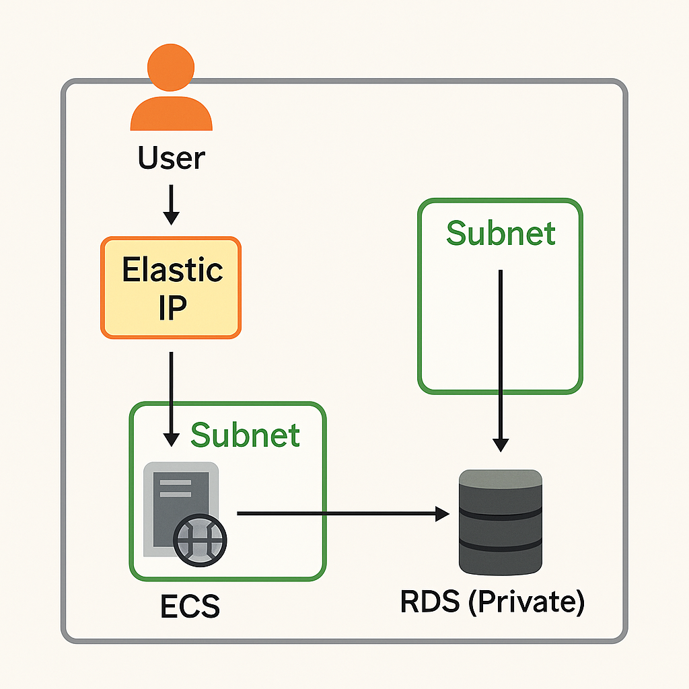

# Enterprise Web App on Huawei Cloud

This project demonstrates how to deploy a simple enterprise web application using Huawei Cloud services, including ECS, RDS, and networking components like VPC, EIP, and Security Groups.

---

## 🏗 Architecture Overview

The architecture includes:

- **VPC** with 2 Subnets:
  - **WebSubnet** (ECS)
  - **DBSubnet** (RDS)
- **Elastic Cloud Server (ECS)** hosting a simple HTML webpage.
- **Relational Database Service (RDS)** using MySQL 8.0 for backend data.
- **Elastic IP (EIP)** attached to ECS for public access.
- **Security Groups** configured to allow HTTP (port 80) and MySQL (port 3306) access.

---

## 🔧 Services Used

| Service           | Purpose                          |
|-------------------|----------------------------------|
| VPC               | Isolated network environment     |
| ECS               | Hosts the web application        |
| RDS (MySQL 8.0)   | Stores backend data              |
| EIP               | Provides public access to ECS    |
| Security Groups   | Controls traffic                 |
| Subnets           | Separates ECS and RDS            |

---

## ⚙️ Step-by-Step Setup

### A. VPC & Subnet
- Created custom **VPC**: `EnterpriseVPC`
- Two subnets:
  - `WebSubnet` (for ECS)
  - `DBSubnet` (for RDS)

### B. ECS
- Created ECS instance in `WebSubnet`
- Installed Apache & hosted HTML file
- Attached **EIP** for internet access

### C. RDS (MySQL)
- Deployed RDS in `DBSubnet`
- MySQL 8.0 (Primary-Standby)
- Connected from ECS using private endpoint

### D. Security Groups
- Allowed inbound:
  - Port 80 (HTTP)
  - Port 3306 (MySQL)

### E. NAT Gateway (Skipped)
- NAT Gateway setup was attempted but skipped due to permissions.

---

## 🧪 Testing & Screenshots

See the [`screenshots/`](screenshots/) folder for full step-by-step screenshots of:

- VPC/Subnet creation
- ECS setup & public web access
- RDS deployment & private connectivity
- Security Group configurations

---

## 🌐 How to Access the App

The deployed web app can be accessed via the ECS's public IP:

👉 [http://159.138.103.226/](http://159.138.103.226/)

---

## 📁 Folder Structure

